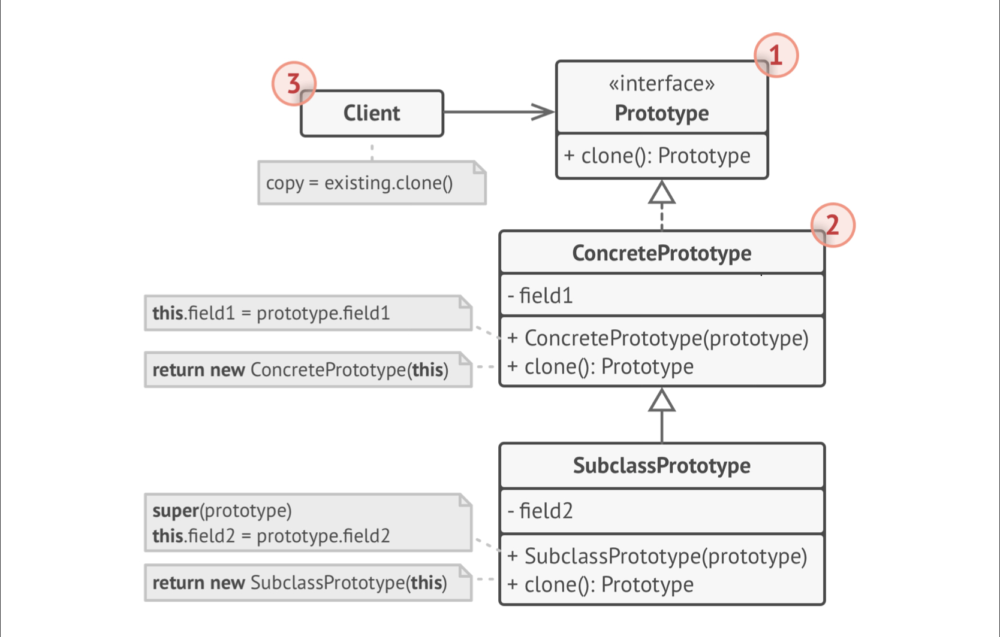
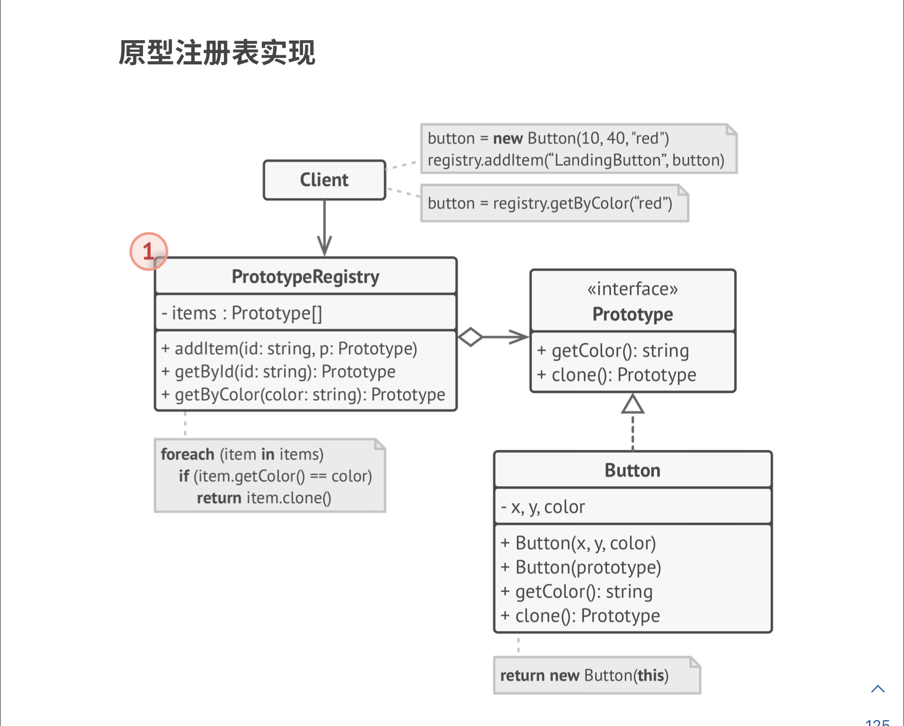

# 0.问题和解决方案

- 希望得到一个对象完全一样的复制体，如何实现？
  - 首先需要初始化一个相同类的对象
  - 然后需要将原始对象的所有成员变量值复制到新对象中
- 问题：
  - 可能不知道对象的类，因为客户端可能只知道其接口
  - 对象的私有成员变量不能访问
- 解决：将克隆的任务委托给实际对象本身。该模型让所有支持克隆的对象实现一个接口（prototype，或者是unity里的prefab），该方法创建一个当前类的对象，并将当前对象的所有属性复制过去

## 1. 类图

- Prototype接口通常只声明一个clone方法，除了要new新对象、将原始对象数据复制过来，还可能需要处理极端情况：如克隆关联对象、梳理递归依赖等

- 原型注册表：提供访问常用原型的简单方法，存储了一系列可供复制的预制体对象。这里使用名称->原型哈希表，也可能用其他实现

## 2. 适用场景

- 希望复制一些对象，又希望代码独立于这些对象的具体类。尤其是客户端接受第三方传进来的对象，不知道其具体信息，所以不能依赖于其具体类。原型模式将clone作为对象的一个接口，客户端只需要调用传进来的对象的接口即可完成克隆。于是，客户端代码与对象的具体类代码相互独立。
- 如果子类区别仅为对象的初始化方式（如OkButton和CancleButton仅有按钮文本属性不同），就可以使用原型模式减少子类数量——因为客户端「创建子类对象」可以转变为「创建特定原型（具有不同属性）的克隆」。这需要原型注册表，先生成一系列备用的prefab，然后客户端按照需要去克隆，而不需要对子类进行实例化。
