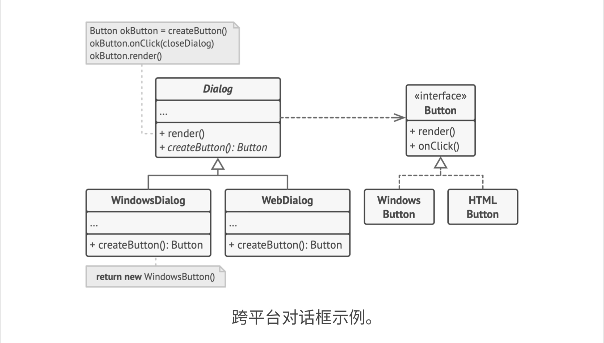

## 1. 类图

- Dialog为创建者、工厂，Button为产品。

- 要注意，创建者并不只负责创建产品，还包含核心业务逻辑，比如这里的render()，代码里的添加监听器。
- 创建也不一定就new新的实例，也可能从缓存、对象池等取出已有对象。

## 2. 适用场景

- 无法预知对象确切类别和依赖关系。
  - 工厂方法分离创建和使用，如果要添加新产品，只需要创建新子类，而不需要知道其他代码
- 希望用户能扩展软件库或框架的内部组件。
  - 我们扩展开源UI框架，希望支持RoundButton
  - 先编写RoundButton子类继承Button，渲染圆形按钮
  - 再编写UIWithRoundButtons子类基础UIFrame，重写其createButton方法使之创建RoundButton，即可在客户端使用该子类创建带圆形按钮的UI了
- 希望复用已有对象，而不是每次都创建新对象
  - 包含的逻辑有：创建存储已有对象的空间，客户端请求对象时从空间中找，并返回客户端，找不到则创建新对象并添加到空间中
  - 这些代码可以放在ctor中，但定义上ctor只返回新对象
  - 因此可以用工厂方法，让它负责即可以重用对象、又可以创建新对象
