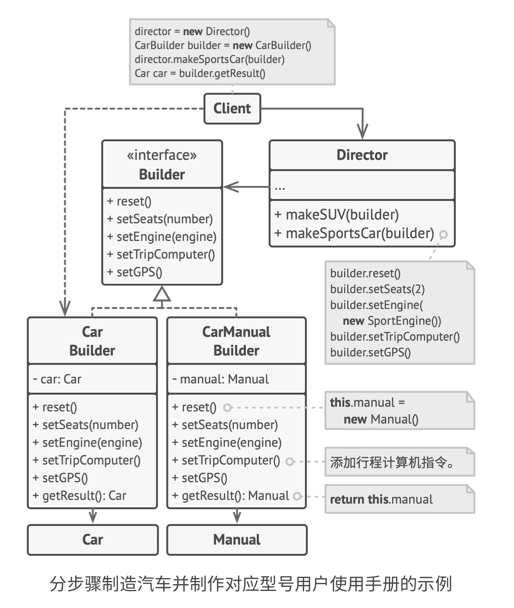

# 0.问题和解决方案

需要建造一个复杂对象，它具有很多属性变量、方法等需要初始化。这些初始化代码可能都在一个ctor里，使得这个ctor非常复杂；或者散落在各处，难以维护。

如果给每个可能的对象都创建一个子类，为它们创建一个公共父类，这样会增加很多新类，甚至出现指数级增加（之前写过相关笔记）

如果用一个类解决，那么这个类的ctor的参数列表会很长，而且每次实例化，其中大部分参数都是false、null等。

---

建造者模式把一个对象的各个部分的构造从类中抽取出来，作为builder的一个方法。此时，要构建复杂对象，只需要让builder按顺序配置那些步骤。而如果想要不同类别的产品，如之前的现代风、复古风等，可以创建不同的builder，它们的具体实现会不同。

可以选择让客户端按顺序配置这些步骤，但更好创建一个director来管理创建复杂产品的步骤，让这个过程对客户端隐藏，且让这个过程可以重复使用。这样，客户端只需要将一个builder和一个director关联，让director来构造产品，就可以从builder处获取产品。

（如果从director处获取产品怎么样？客户端不需要创建builder，只需要调用director的不同方法，来创建不同类型产品。但这样产品类型和director方法相关，违背开闭原则，如果用builder子类来区分更合理。客户端创建对应产品类型的builder子类，创建一个通用的director，然后将其关联起来

此外，不同类型的builder返回的产品类型完全不同，所以director获取产品的话会发生耦合，不如让director一次只能关联一个builder）


## 1. 类图



- 汽车是复杂产品，设计座椅、引擎、导航等各种组件

- 这里假设要创建汽车和汽车手册两种产品，产品种类通过builder子类去区分

- 汽车有Sports和SUV两种类别，通过director使用参数区分


## 2. 适用场景

- 避免「重叠构造函数」，就像上面说的，复杂对象的ctor可能很复杂，需要很多重载、很长的参数列表

```c++
class Pizza
{
  Pizza(int size) {...}
  Pizza(int size, bool cheese) {...}
  Pizza(int size, bool cheese, bool pepperoni) {...}
};
```

- 创建的产品具有**相同步骤**，仅在**细节上有差异**。builder定义了所有创建步骤和定义细节，director负责按顺序调用它们并指定细节
