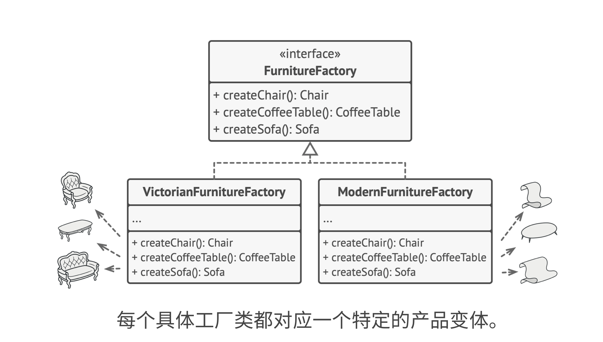

## 1. 类图

- 每件产品明确声明接口，如桌子、椅子、沙发。所以产品变体都继承这些接口。

- 同一个对象的所有变体放在同一个类层次结构中。

- 声明抽象工厂，每个工厂对应一种变体（现代、复古），每个工厂都包含创建所有产品的接口（生产椅子、生产桌子、生产凳子）
- 这些create接口返回的是抽象产品类型
- 客户端不需要知道工厂类型，即不需要知道变体，只需要调用抽象接口，如sitOn。
- 工厂返回的椅子变体总是和同一工厂对象创建的沙发、凳子等属于同一个变体（现代风、复古风）
- 选择工厂类别（变体类别、家具风格）的代码，即创建具体工厂对象的代码，是应用程序根据配置文件初始化的。

## 2. 适用场景

- 需要和多个不同系列的产品交互，而且不希望基于产品具体类去构建、希望有扩展性。抽象工厂提供可用于创建每个系统产品的接口，只要配置完毕，就不会生成类型不一致的产品
- 每个类只应该负责一件事。如果有一个基于一组抽象方法的类，其主要功能变得不明确，就可以用抽象工厂将其方法抽取到独立的工厂类中
