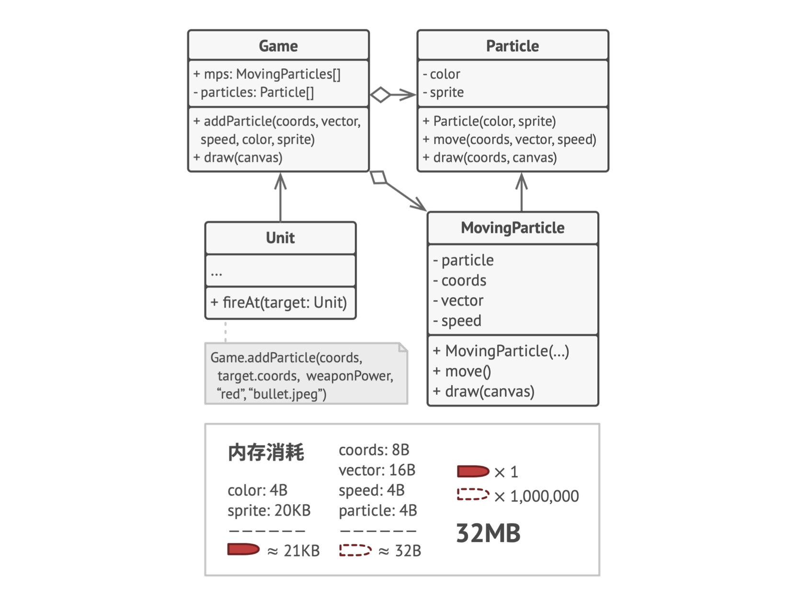
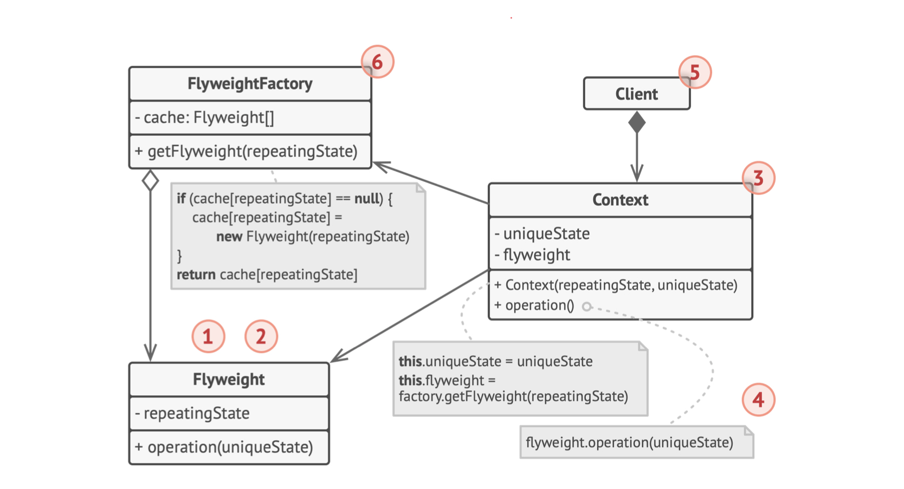

# 0.问题和解决方案

- 游戏中存在大量具有重复属性的对象，如满屏子弹，虽然每个子弹位置、速度矢量不同，但具有相同的sprit、伤害等属性，这些重复属性浪费大量内存
- 为了避免重复属性，可以将这些属性抽象为一个对象，然后将这些对象组织为一个列表，每个对象只存储自己的位置、速度矢量等属性
- 享元不可变：享元对象的属性不可变，如果需要改变属性，只能创建新的享元对象
- 享元工厂：负责创建和管理享元对象，当客户端请求一个享元对象时，享元工厂检查是否已经创建过该对象，如果已经创建则直接返回，否则创建新的对象并返回

## 1. 类图

## 2. 适用场景

- 大量对象具有相同或相似的属性，且这些属性可以抽象出来作为一个对象
- 实现：将要改写为享元的对象拆分为内部状态和外部状态，内部状态（sprite）作为享元对象的属性，外部状态（position）作为方法参数传入
