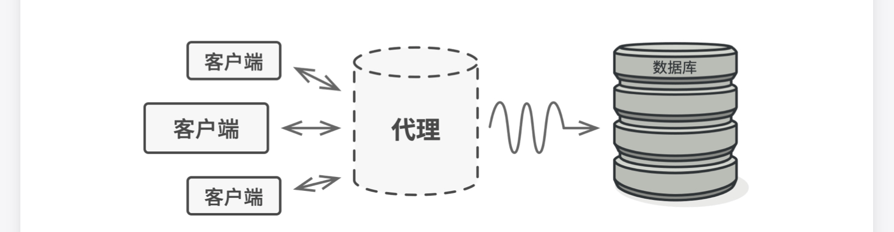
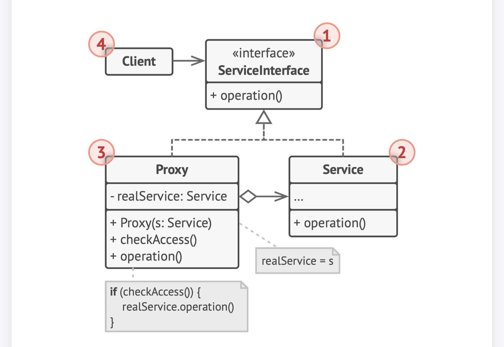

# 0.问题和解决方案

- 有一个数据库对象，大量客户端需要对其发起访问请求，但每个客户端并不经常使用它，且每次查询数据非常缓慢
- 使用代理：代理类和数据库类实现完全一样的接口，代理将所有实际工作委派给数据库，客户端调用代理类就和调用数据库本身完全一致
- 但代理类可以控制对数据库的访问，比如缓存数据，减少对数据库的访问次数

## 1. 类图

- 服务接口：定义了代理和真实主题的公共接口，这样就可以在任何使用真实主题的地方使用代理
- 服务（数据库）：定义了代理所代表的真实主题
- 代理：保存一个引用使得代理可以访问实体，并提供一个与服务接口相同的接口，这样代理就可以用来替代实体
- 客户端：向一个代理发送请求，代理处理部分请求，或者将请求传递给服务

## 2. 适用场景

- 