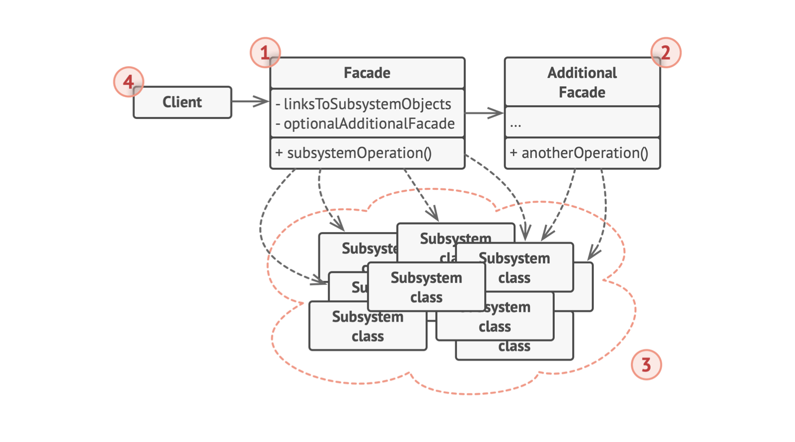

# 0.问题和解决方案

- 如果框架中对象很多，客户端需要与这些对象耦合：负责其初始化、依赖关系和顺序执行等
- 解决：用“外观”类对框架进行高级封装，客户端与框架对象隔离，只需要调用外观对象的少量接口
- 例子：cocos2dx背后控制游戏逻辑有很多类，但客户端只需要通过导演或一些简单的接口就可以控制游戏的运行、场景切换、资源加载等

## 1. 类图

- 外观类对大量框架对象进行封装，客户端只需要调用外观类的接口，从而与框架对象隔离
  - 如果框架对象改变，只需要修改外观类中的代码，无需改变客户端
- 创建**附加外观**，避免单一外观具有太多功能，又变成复杂结构
  - 如游戏引擎有负责场景切换的类、有负责资源加载的类等

## 2. 适用场景

- 需要一个功能有限、可以代替复杂子系统的接口
- 需要将子系统组织为多层结构
  使用外观定义各层次入口，子系统之间使用外观来交互，减少耦合
