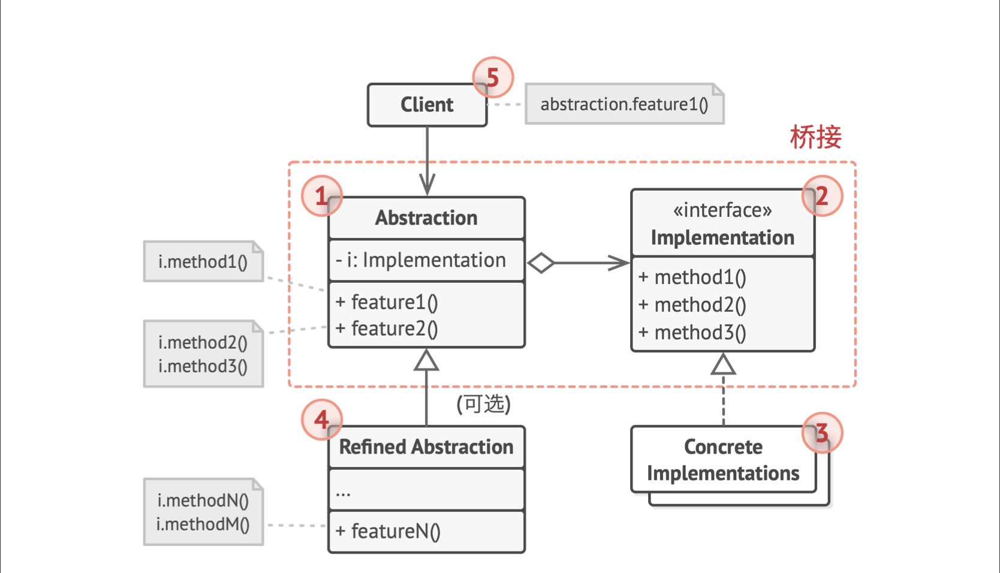
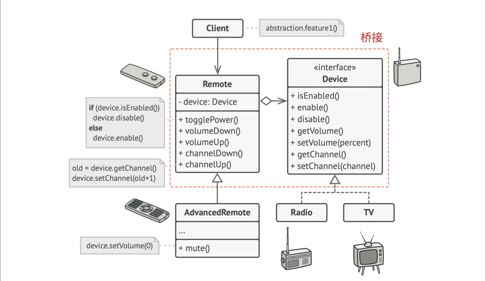

# 0.问题和解决方案

- 问题描述正如之前的“软件设计原则”中“组合优于继承”举的例子，交通工具有Truck和Car，每种有两种引擎Electric和Combustion，每种有两种控制方式Autopiloy和manual control，继承体系就需要具体子类有$2\times 2\times2$种，特征越多乘的越多。就像一个二叉树。但其实很多东西是重复的。
- 解决：把不同维度拆解成不同继承体系，完整的对象由它们进行桥接得到。
- 如两种引擎Electric和Combustion实现同一个接口Engine，两种控制方式Autopiloy和manual control实现同一个接口Control，交通工具Truck和Car实现Vehicle，交通工具子类持有Engine和Control对象，通过调用这些对象的API来完成其功能

## 1. 类图

- GoF书里的实现：抽象部分（GUI）和实现部分（API）
- GUI上有几个feature供用户调用，每个feature有一定内部逻辑，但主要业务是靠调用API完成的
- API有多个实现，比如可以为Windows, Linux 和 macOS分别进行实现，GUI只需要调用相同的接口

- 代码实现的例子，遥控器是抽象部分（GUI），具体设备是实现部分（API）
- 遥控器有toggle、音量上下、频道上下等feature，这些并不直接调用设备的某个接口（两者接口并不相同），而且有一定内部逻辑，但主要靠调用API
- 于是，一个遥控器可以控制不同设备

## 2. 适用场景

- 将一个巨大复杂的类拆分成多个功能模块，然后重组成完整的类，需要使用桥接模式。这样在任意一个维度上的修改都不会影响其他维度。
- 如果希望在多个独立维度上拓展一个类，使用桥接模式。例如Shape类，可以具有多种颜色，多种边框样式，多种渐变风格等。
  - 这些也可以通过类属性实现，但因为它们是离散的、不容易被int、string类型表示（int要事先约定或用Enumerate，string表示名字要记），而且每个属性包含的内容比较多，比如渐变风格有自己的渲染方式，所以拆分成多个类，用桥接进行组合。
- 需要在运行时切换不同实现方式。桥接模式中可以替换抽象部分（GUI）中的实现对象（API），只需要对变量赋值即可。

