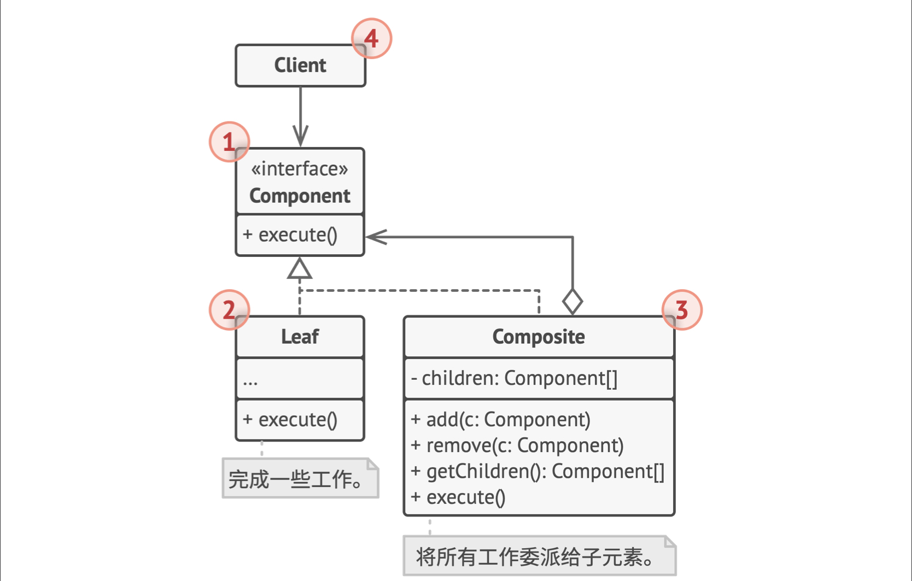

# 0.问题和解决方案

- 应用的核心模式要用树状结构表示
- 使用组合：非叶子结点持有其所有子节点的列表，所有节点实现一个共同接口（非叶子委派任务到下面的子结点，叶子结点实际完成任务），客户端可以通过根结点，递归地让所有叶子结点完成任务

## 1. 类图

- Component 接口描述了叶子和非叶子都实现的操作
- 叶子实际完成工作
- 组合持有并维护一个子结点数组，只负责把任务分发下去

## 2. 适用场景

- 实现树状结构（文件目录）
- 希望客户端以相同方式处理简单和复合元素（File和Directory实现相同接口）
