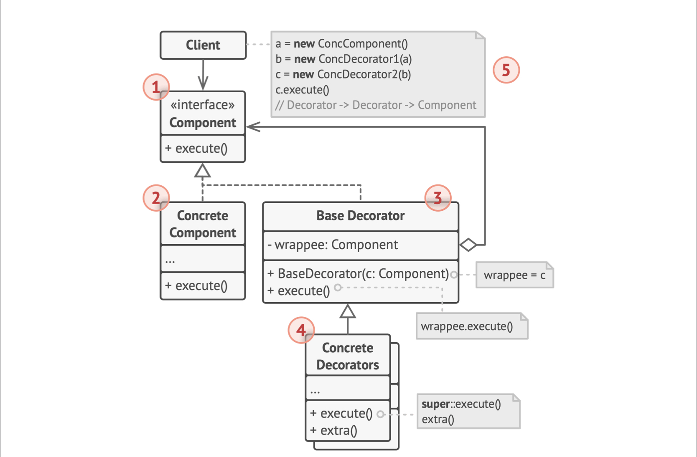

## 1. 类图

- Decorator将Component层层封装
- Component声明Decorator和被封装对象的公共接口
- Concrete Component是被封装的对象，定义了基础行为，Decorator改变这些行为
- Decorator继承体系定义了装饰器：持有一个被封装对象wrappee，实现execute执行方法，每个具体Decorator可以执行额外行为
- 客户端使用多层装饰来封装组件

## 2. 适用场景

- 希望不修改其代码就增加对象额外的行为
- 用继承来扩展对象行为比较困难，如类被final限制
