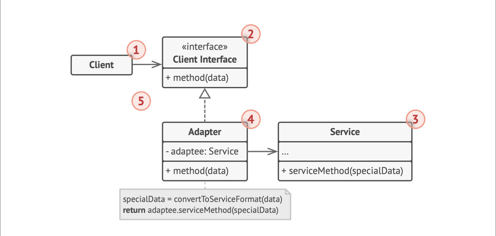

# 0.问题和解决方案

- 需要使用一个程序，它只接受JSON格式文件，但客户端只提供XML格式
- 这样就不能直接使用；也不能修改程序代码；需要在传进程序前做适配工作
- 把适配的任务交给一个Adapter类，它负责转换对象接口，通过封装将复杂的转换隐藏于用户
- 适配器给客户端提供一个接口（XML格式），现有对象就可以安全调用它；适配器转换后调用要使用程序的接口（JSON格式）

## 1. 类图

- 客户端接口描述了客户端与其他类合作时遵循的规范，如XML格式
- 适配器同时和客户端与服务交互，它实现了客户端接口（XML格式），转换为服务对象的调用接口（JSON格式）
- 服务提供一些功能类，对外暴露的接口（JSON）可能和客户端的不适配
- 如果服务类的接口更改，也只需要新增适配器，而不需要修改客户端和已有适配器等已有代码

## 2. 适用场景

- 希望使用某个类（服务），但接口不兼容，则使用适配器类，作为接口转换器
- 需要复用一些类，它们在同一个继承体系中，而且它们有了一些额外的共同的方法，但这些方法不是继承体系中子类所共同具有的
  - 可以扩展每个子类，添加缺少的功能，但这样并不好
  - 将缺失功能添加到一个适配器类中，将缺失该功能的对象封装在适配器中。目标类需要有通用接口。这和装饰模型相似。
