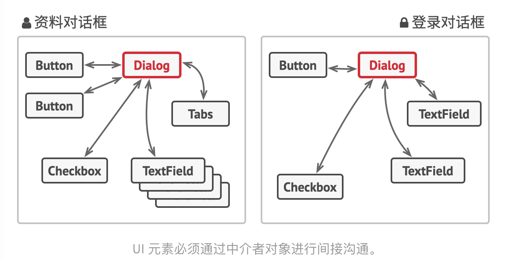
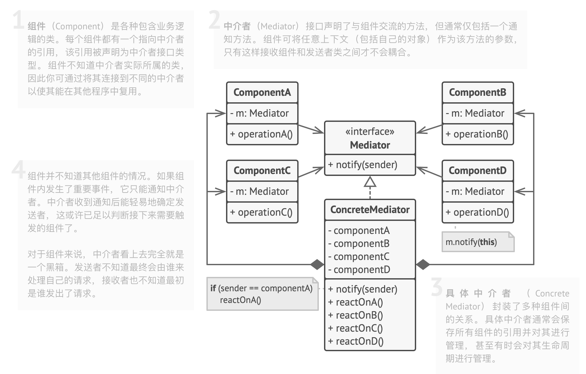

# 0.问题和解决方案

- 考虑表单组件的案例，组件之间会有互动，例如提交按钮需要校验所有输入。
- 如果直接在表单元素代码中实现业务逻辑，则有以下问题：
  - 组件难以复用，因为和其他组件耦合
  - 组件间的关联让某些元素的修改影响其他元素

- 解决方法：
  - 组件变得独立，之间不再耦合
  - 组件必须调用中介者对象，与其他组件间接合作

## 1. 类图

- 组件：包含业务逻辑的类，含有中介者的引用（接口），不育其他组件或具体中介者耦合，因此可以复用
- 中介者：仅包含一个通知方法
- 具体中介者：封装所有组件，保存其引用并管理

## 2. 适用场景

- 类似表单这种，有一堆组件类，需要复用、解除耦合

## 3. 实现方式

