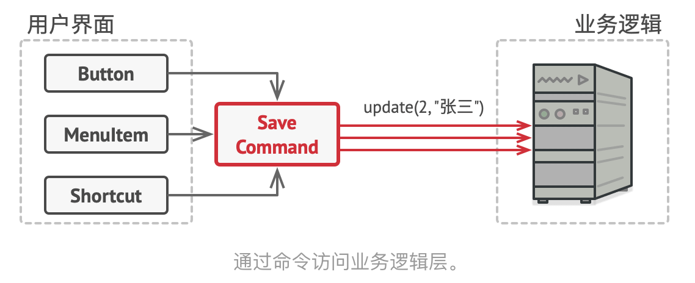
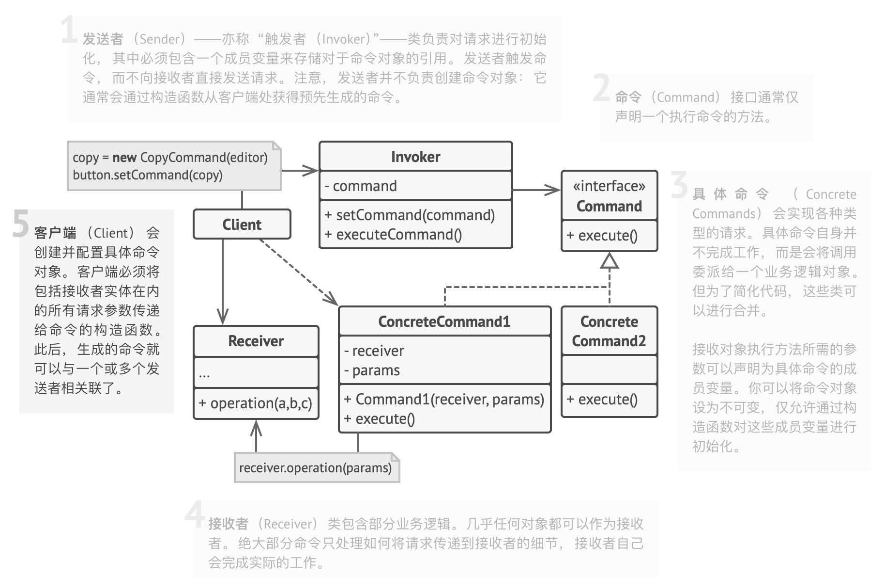

# 0.问题和解决方案

- 界面中有各种不同按钮，Confirm Button、Cancle Button、OK Button等等，它们看上去相似，但执行的任务不同
- 如果为每种按钮创建一个子类，可能的问题：
  - 大量子类导致父类的修改可能牵连子类，即GUI代码依赖于业务逻辑代码，前者应该是稳定而后者是不稳定的
  - 某些操作可能被多个地方调用，如copy可以通过右键复制、可以common+C，子类的方式无法复用，造成代码重复

- 解决：
  - GUI和业务逻辑分层：GUI 层负责在屏幕上渲染美观的图形， 捕获所有输入并显示用户和程序工作的结果。 当需要完成一些重要内容时 （比如计算月球轨道或撰写年度报告）， GUI 层则会将工作委派给业务逻辑底层
  - 命令模式建议 GUI 对象不直接提交这些请求。 你应该将请求的所有细节 （例如调用的对象、方法名称和参数列表） 抽取出来组成*命令*类， 该类中仅包含一个用于触发请求的方法
  - 所有命令实现相同接口，只有一个无参数方法`execute()`。没有参数，命令如何包含请求的详情？使用数据对命令进行预先配置， 或者让其能够自行获取数据。
  - 这样不再需要在命令子类里实现业务逻辑，GUI元素通过保存命令子类变量与其连接，与相同操作相关的元素将会被连接到相同的命令， 从而避免了重复代码

## 1. 类图

## 2. 适用场景

- 
