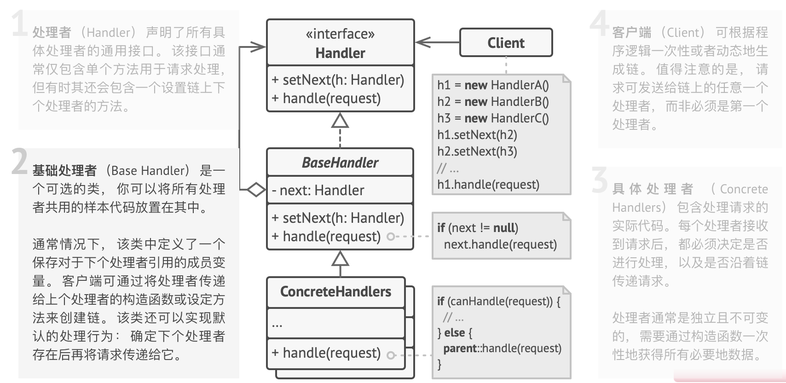

# 0.问题和解决方案

- 一个系统访问管理系统，需要对请求进行身份认证、检查凭证、过滤重复请求等步骤，且不断有新增步骤需求。
- 整个流程变得非常臃肿，某个步骤的修改可能影响到其他步骤
- 需要复用一些步骤时，只能copy其中的部分代码
- 解决：使用责任链
  - 将特定行为转化为“处理者”对象（只有一个方法的类），执行检查操作，请求及其数据作为参数传递
  - 链上的每个处理者都有一个成员变量来保存对于下一处理者的引用（C#后端，controllers有_BLL，BLL层有\_DAL）
  - 处理者可以决定不再沿着链传递请求， 这可高效地取消所有后续处理步骤；也可以处理者接收到请求后自行决定是否能够对其进行处理、是否继续传递
  - 所有处理者类均实现同一接口，每个具体处理者仅关心下一个包含 `execute`执行方法的处理者

## 1. 类图

## 2. 适用场景

- 需要用不同方法对不同类型请求进行处理，且事先未知请求顺序，使用责任链让每个责任对象都能过目请求，并决定是否能处理
- 类似链表的结构，可以通过改变引用变量来改变处理顺序
