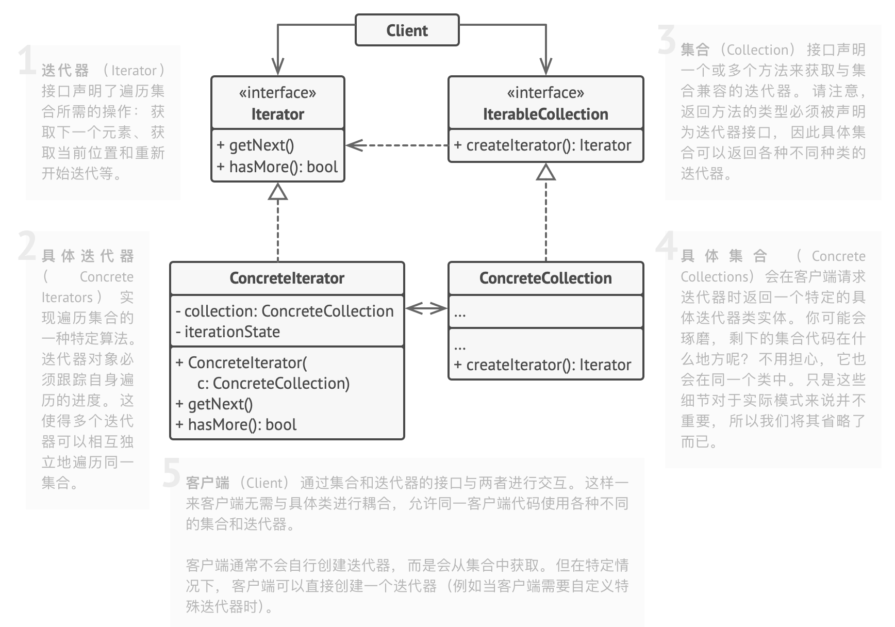

# 0.问题和解决方案

- 迭代器模式能在不暴露集合底层表现形式 （列表、 栈和树等） 的情况下遍历集合中所有的元素
- 不管集合的底层实现，它应该提供一种遍历元素的方式
- 如果使用复杂实现的集合，如树，有多种遍历方式，在集合类中添加遍历算法、让客户端代码与集合实现耦合，都是不可取的实现

## 1. 类图

## 2. 适用场景

- 希望对客户端隐藏复杂数据结构，仅暴露其遍历的接口

## 3. 实现方式

- 声明迭代器接口，实现获取下一个元素、是否有下一个元素等方法
- 声明集合接口，实现获取不同种类迭代器方法
- 实现具体迭代器类，与单个实体集合连接
